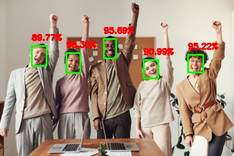

## Face Detection & Blurring Utility

A simple utility to detect faces from both **image files** and **live webcam feeds**, with an optional face blurring feature.
Under the hood, it leverages OpenCV's deep learning module (`cv2.dnn`) and a **Caffe-based SSD model** for accurate and real-time face detection.

---

## Description

This application detects human faces from images or live webcam streams. Based on the mode selected, it can:

- Draw **green bounding boxes** around detected faces
- **Blur** detected faces for privacy

---

## Sample Output

### Face Detected (Green Box)


### Face Blurred


---

## Installation

To install the utility globally as a CLI tool named `face.detector`, run:

```bash
chmod +x ./install.sh
./install.sh
```

This will install the script into `/usr/local/bin`.

---

## How to Use (After Installation)

## Live Mode (Detect Faces from Video Feed via Camera)

```bash
face.detector
```
or with blur:
```bash
face.detector -b
```

This will:
- Show usage instructions
- Prompt: _"This utility is going to access your camera. Are you okay with that? [Y]:"_
- If the user confirms (`y` or `Y`), it starts webcam-based face detection

---

### Detect Faces in an Image
```bash
face.detector -f <image_file>
```

### Detect and Blur Faces in an Image
```bash
face.detector -f <image_file> -b
```

---

## Output

Processed files are saved in the **current working directory**, with filenames like:

- `your_image_face_detected.jpg`
- `your_image_face_blurred.jpg`

> _(Only applies to file-based image processing)_

---

## Background

This tool uses a **Caffe-based face detection model** developed by the OpenCV team. It utilizes **ResNet-10** as the backbone in a **Single Shot MultiBox Detector (SSD)** framework, optimized for real-time face detection using `cv2.dnn`.

---

### Neural Network Architecture (Model Definition)

The model architecture is defined in:

```
src/neural.net/deploy.prototxt.txt
```

This file outlines the structure of the neural network, which is based on **ResNet-10 + SSD (Single Shot MultiBox Detector)**. It includes:

- **Input Layer**: Accepts 300x300 RGB images 
- **Convolutional Layers**: Feature extraction 
- **ReLU Activations**: Non-linearities between layers
- **Pooling Layers**: Dimensionality reduction
- **Fully Connected Layers**: Higher-level feature interpretation
- **Detection/Output Layers**: Outputs bounding boxes and confidence scores for faces

---

### Trained Model

The pre-trained model weights are stored in:

```
src/model.with.trained.weights/res10_300x300_ssd_iter_140000.caffemodel
```

This file contains the trained weights for the SSD-ResNet10 model, enabling accurate face detection right out of the box without requiring retraining.

---

## License

OpenCV and its models are released under open-source licenses, specifically the Apache License 2.0 (January 2004). This utility, which is a convenient CLI wrapper built on top of OpenCV's models, is licensed under the MIT License.

---

## References

1. [OpenCV Face Detector Repository](https://github.com/opencv/opencv/tree/master/samples/dnn/face_detector)
2. [Sample Image – Success Test Case](https://www.pexels.com/photo/3184419/)
3. [Sample Image – Failed Test Case](https://www.pexels.com/photo/a-group-of-people-sitting-on-a-couch-playing-video-games-23495570/)
